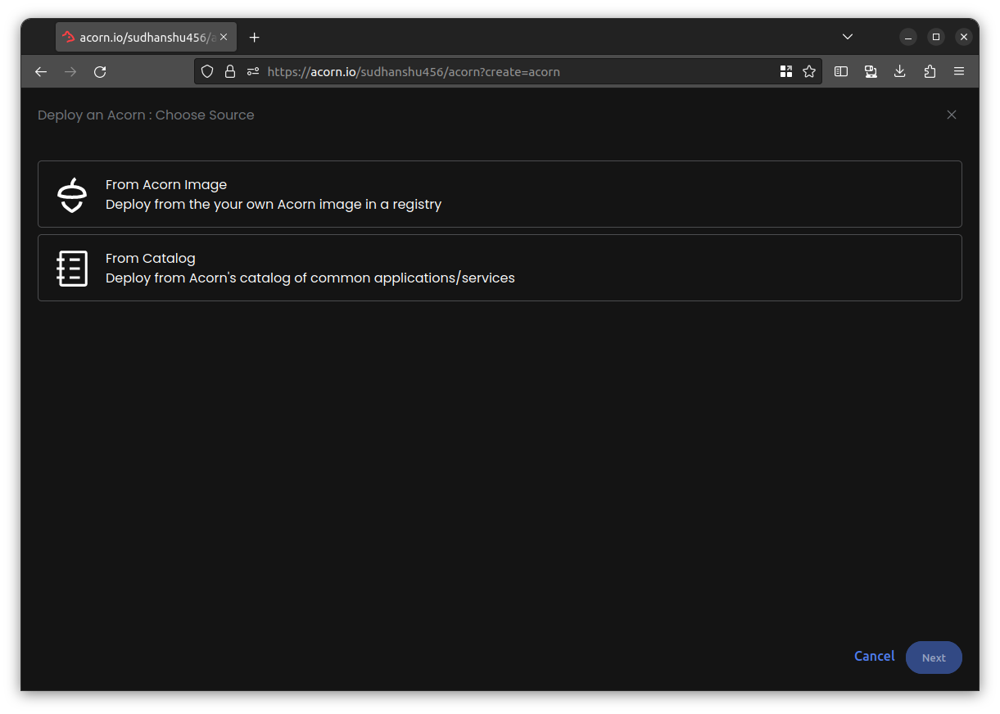
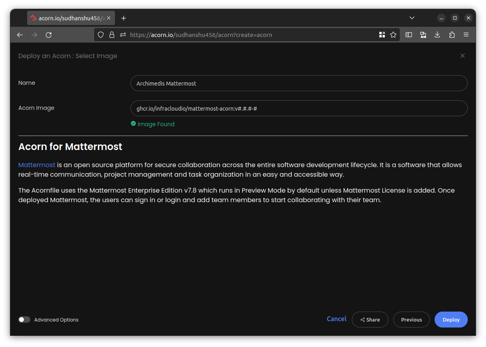
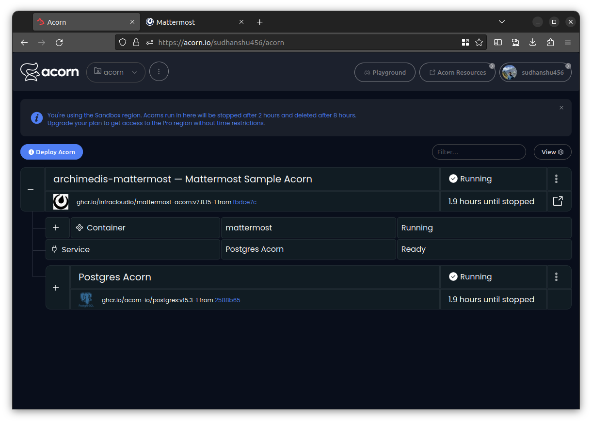
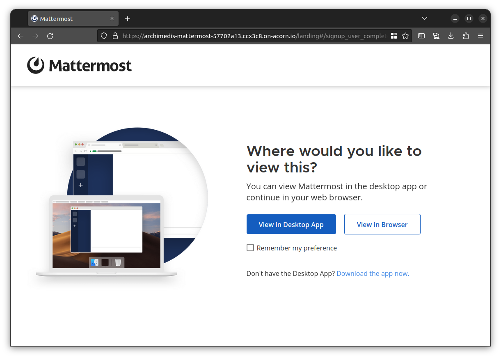
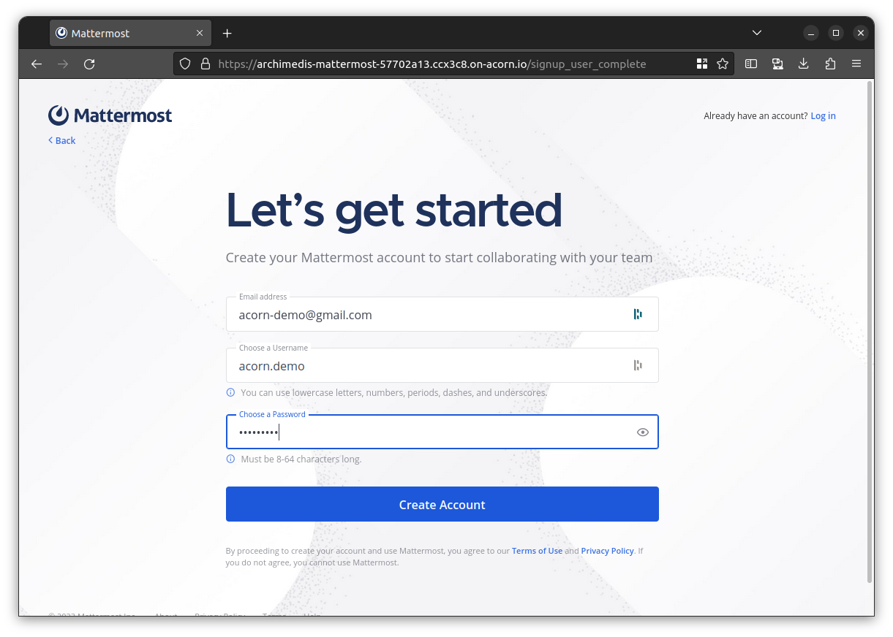
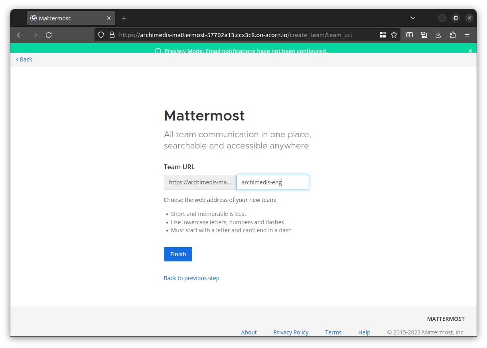
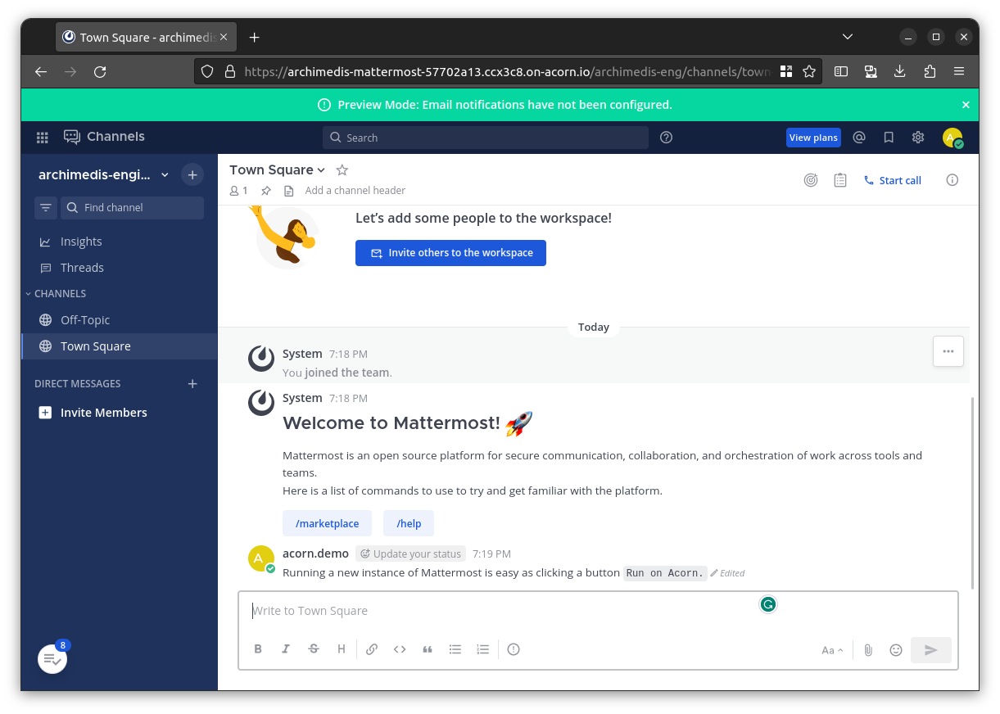
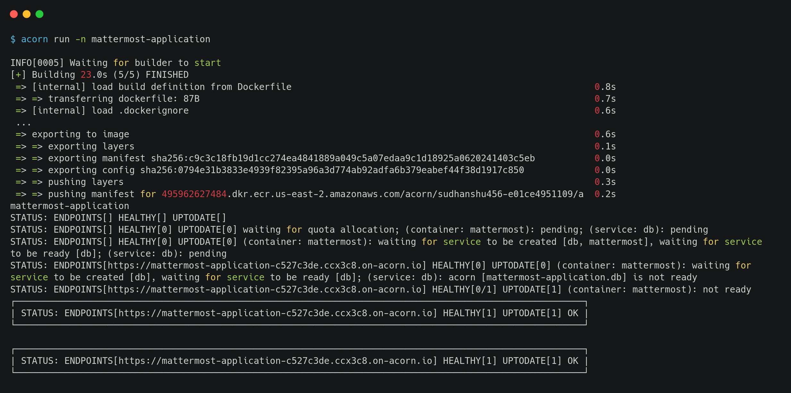
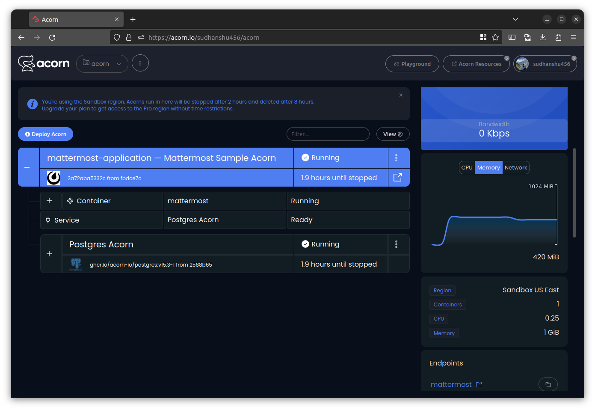

# Deploying Mattermost on Acorn

This is where [Acorn](http://www.acorn.io) comes in, it is a user-friendly cloud platform, simplifies deploying modern cloud-native apps with a free sandbox accessible through GitHub account. It streamlines development workflows using mainstream container tools, providing the power of Kubernetes and Terraform without complexity.

Deploying on Acorn is simple as defining your application with an [Acornfile](https://docs.acorn.io/reference/acornfile), generating a deployable Acorn Image.

In this tutorial, we'll see how to set up your Mattermost application.

If you want to skip to the end, just click [](https://acorn.io/run/ghcr.io/infracloudio/mattermost-acorn:v%23.%23.%23-%23?ref=sudhanshu456&name=Archimedis+Mattermost) to launch the app immediately in a free sandbox environment. All you need to join is a GitHub ID to create an account.

> _Note: Everything shown in this tutorial can be found in [this repository](https://github.com/infracloudio/mattermost-acorn)_.

## Pre-requisites

- Acorn CLI: The CLI allows you to interact with the Acorn Runtime as well as Acorn to deploy and manage your applications. Refer to the [Installation documentation](https://docs.acorn.io/installation/installing) to install Acorn CLI for your environment.
- A GitHub account is required to sign up and use the Acorn Platform.

## Acorn Login

Log in to the [Acorn Platform](http://acorn.io) using the GitHub Sign-In option with your GitHub user.


After the installation of Acorn CLI for your OS, you can login to the Acorn platform.

```sh
$ acorn login
```

## Deploying the Mattermost server

There are two ways to deploy Mattermost server on Acorn Platform.

1. Using Acorn platform dashboard.
2. Using CLI

The Acorn Dashboard way is the easiest one where, in just a few clicks you can deploy the Mattermost on the platform and start using it. However, if you want to customize the application use the CLI option.

## Deploying Using Acorn Dashboard

In this option you use the published Acorn application image to deploy the Mattermost application in just a few clicks. It allows you to deploy your applications faster without any additional configurations. Let us see below how you can deploy Mattermost server to the Acorn platform dashboard.

1. Login to the [Acorn Platform](https://acorn.io/auth/login) using the GitHub Sign-In option, using your own GitHub account.
2. Select the "Deploy Acorn" option.
3. Choose the source for deploying your Acorns
   3.1. Select “From Acorn Image” to deploy the sample Application.

   

   3.2. Provide a name "Archimedis Mattermost” and provide the URL for the Acorn image.

   ```sh
   ghcr.io/infracloudio/mattermost-acorn:v#.#.#-#
   ```

   

> _Note: The App will be deployed in the Acorn Sandbox Environment. As the App is provisioned on Acorn Platform in the sandbox environment it will only be available for 2 hrs and after that it will be shutdown. Upgrade to a pro account to keep it running longer_.

4.  Once the Acorn is running, you can access it by clicking the `Endpoint` or the redirect link.

    4.1. Running Application on Acorn

    

    4.2 Setting up the application
    Mattermos require admin account creation if it is fresh instance, and ask you choose the preferred way to view it.

    

    4.3 Configuring Admin Credentials

    

    4.4 Creating new team

    

    4.5. Running Mattermost

    
    This is it, now you have Mattermost application up and running, in just few steps using Acorn Platform.

## Deploying Using Acorn CLI

As mentioned previously, running the Acorn application using CLI lets you understand the Acornfile. With the CLI option, you can customize the Mattermost app to your requirement or use your Acorn knowledge to run your own Mattermost Server.

To run the application using CLI you first need to clone the source code repository on your machine.

```sh
$ git clone https://github.com/infracloudio/mattermost-acorn.git
```

Once cloned here’s how the directory structure will look.

```sh
.
├── Acornfile
├── assets
├── LICENSE
├── mattermost-icon.png
├── README.md
├── tutorial.md
└── volumes
```

### Understanding the Acornfile

To run the application we need an Acornfile which describes the whole application without all of the boilerplate of Kubernetes YAML files. The Acorn CLI is used to build, deploy, and operate Acorn on the Acorn cloud platform. It also can work on any Kubernetes cluster running the open source Acorn Runtime.

Below is the Acornfile for deploying the Mattermost Server that we created earlier:

```sh
name:        "Mattermost Sample Acorn"
description: "Acorn running a sample Mattermost app"
readme:      "./README.md"
icon:        "mattermost-icon.png"


args: {
  // Name of the database to create. Defaults to "mattermost"
  dbName: "mattermost"
  // Name of the database user to create. Defaults to "mattermost"
  dbUser: "mattermost"
}

services: db: {
  image: "ghcr.io/acorn-io/postgres:v15.#-#"
  serviceArgs: {
      dbName: args.dbName
      dbUser: args.dbUser
  }
}

containers: {
  mattermost: {
    image: "mattermost/mattermost-enterprise-edition:7.8"
    env: {
      "TZ": "UTC"
      "MM_SQLSETTINGS_DRIVERNAME": "postgres"
      "MM_SQLSETTINGS_DATASOURCE":"postgresql://@{service.db.secrets.admin.username}:@{service.db.secrets.admin.password}@@{service.db.address}:5432?sslmode=disable&connect_timeout=10"
      "MM_BLEVESETTINGS_INDEXDIR": "/mattermost/bleve-indexes"
      "MM_SERVICESETTINGS_SITEURL": "https://@{services.mattermost.endpoint}"
      "POSTGRES_USER": "@{service.db.secrets.admin.username}"
      "POSTGRES_PASSWORD": "@{service.db.secrets.admin.password}"
      "POSTGRES_DB":"@{service.db.data.dbName}"
    }
    ports: {
      publish: "8065:8065/http"
    }
    consumes: ["db"]
    sidecars: {
      setup: {
        image: "busybox:1.36"
        init: true
        dirs: {
            "/mattermost/config": "./volumes/app/mattermost/config"
            "/mattermost/data": "./volumes/app/mattermost/data"
            "/mattermost/logs": "./volumes/app/mattermost/logs"
            "/mattermost/plugins": "./volumes/app/mattermost/plugins"
            "/mattermost/client/plugins": "./volumes/app/mattermost/client"
            "/mattermost/bleve-indexes": "./volumes/app/mattermost/bleve-indexes"
        }
        cmd: ["/bin/sh", "-c", "chown -R 2000:2000 ./mattermost/logs"]
      }
    }
  }
}
```

Here’s a quick description of the Acornfile above. For a full overview of the Acornfile specification please see Acorn [documentation](https://docs.acorn.io/authoring/overview).

- `containers`: section describes the set of containers your Acorn app consists of.
- `ports`: using the publish type, we expose the app outside the cluster using an auto-generated ingress resource
- `dirs`: Directories to mount into the container filesystem
- `services`: defines cloud services that will be provisioned for your application. Here we're using the [Postgres](https://github.com/acorn-io/postgres) service that is built into Acorn as an [Acorn Service](https://docs.acorn.io/reference/services).
- `args`: this allowes allow users to provide input at different points in the Acorn lifecycle.
- `env`: environment variables, referencing a secret or referencing an Acorn argument
- `consumes`: It helps in defining which service is required for container to run.
- `sidecar`: are containers that run colocated with the parent container and share the same network address, and storage.

### Deploying the Application

Once you've logged using Acorn CLI you can directly deploy applications on the Acorn platform Sandbox plan. Run the following command from the root of the directory.

```sh
$ acorn run -n mattermost-application
```

Below is what the output looks like.



## Using the application

Once you follow one of the above methods of deploying the Mattermost, you’ll get a endpoint in the Acorn dashboard or in the CLI output, that will help you reach to your application in browser.

For this sample deployment the endpoint url is `https://mattermost-application-c527c3de.ccx3c8.on-acorn.io`

Before you began using the Mattermost, it requires admin account creation which will happen once you open the provided endpoint, it should automatically redirect to get srarted page.


## Acorn Dashboard

The Acorn Dashboard is integrated with multiple features such as Events, Logs, Details and accessing the Shell of the Application. Details include the CPU, Memory, Network, and Errors for the Application.



> Explore various available options by clicking the Menu option on your Acorn App and to access the Acorn Dashboard head to [Acorn.io](https://www.acorn.io/) and login with your credentials.

## Development Mode

In development mode, Acorn will watch the local directory for changes and synchronize them to the running Acorn app. In general, changes to the Acornfile are directly synchronized, e.g. adding environment variables, etc. Depending on the change, the deployed containers will be recreated.

If you've defined a line `if args.dev { dirs: "/app": "./" }` in the Acornfile, it will enable hot-reloading of code by mounting the current local directory into the app container.

You will see the change applied when you reload the application's page in your browser, in case of Mattermost, we don't have any application code, except Acornfile, which will be by default on watch if you run dev mode.

## How to Build and Push an artifact to a registry

Once you're done with the changes, and application is working as expected, you can proceed to build and packaging to a registry, later the acorn image can be used directly in the Acorn platform using the dashboard, as described earlier in running the application using Dashboard.

To understand how this works, let assume you want to push it to GCR(GitHub Container Registry).

### Log in to the registry

Before building and you need to login to the desired container registry you wish to push. In below example we're logging into GitHub Container Registry.

```sh
acorn login ghcr.io
```

### Build and push the image

After, login you can build, tag and push the image using the below command.

```sh
acorn build -t ghcr.io/infracloudio/mattermost-acorn:v0.0.0.1 --push
```

## What's Next?

1. Any app provisioned under Acorn sandbox region is available for only 2hrs, in order to keep it running longer you need to upgrade to Pro account.
2. After deploying you can edit the Acorn Application or remove it if no longer needed. Click the Edit option to edit your Acorn's Image. Toggle the Advanced Options switch for additional edit options.
3. Remove the Acorn by selecting the Remove option from your Acorn dashboard.

## Conclusion

In this tutorial, we have learned how to deploy a Mattermost application on Acorn Platform by defining cloud services information into an Acornfile. Then we explored the Acorn Platform Dashboard to gain useful insights of deployed application.

Lastly, we saw an example to build and push changes to registry, which later can be directly used in Acorn Platform.
